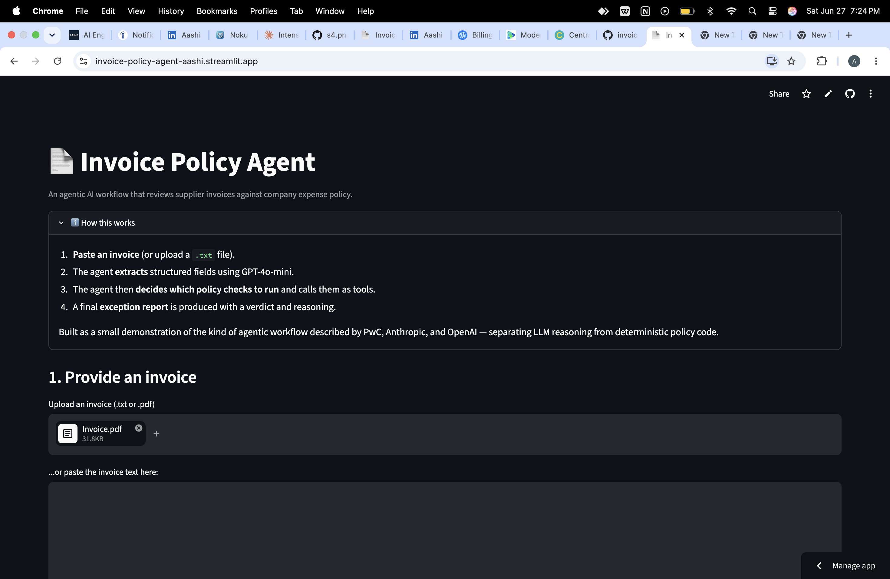
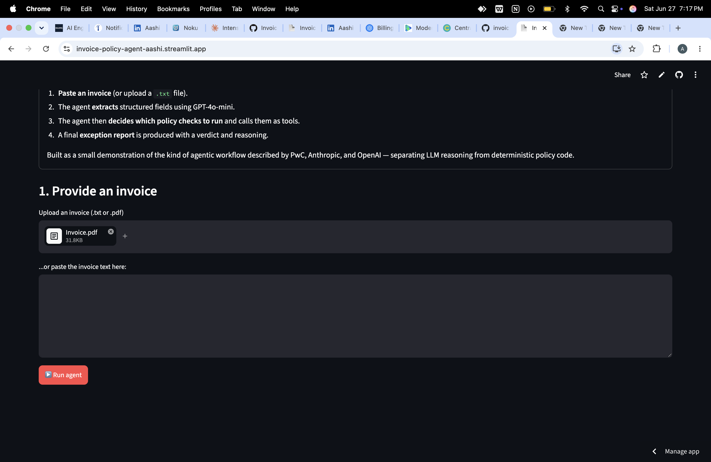
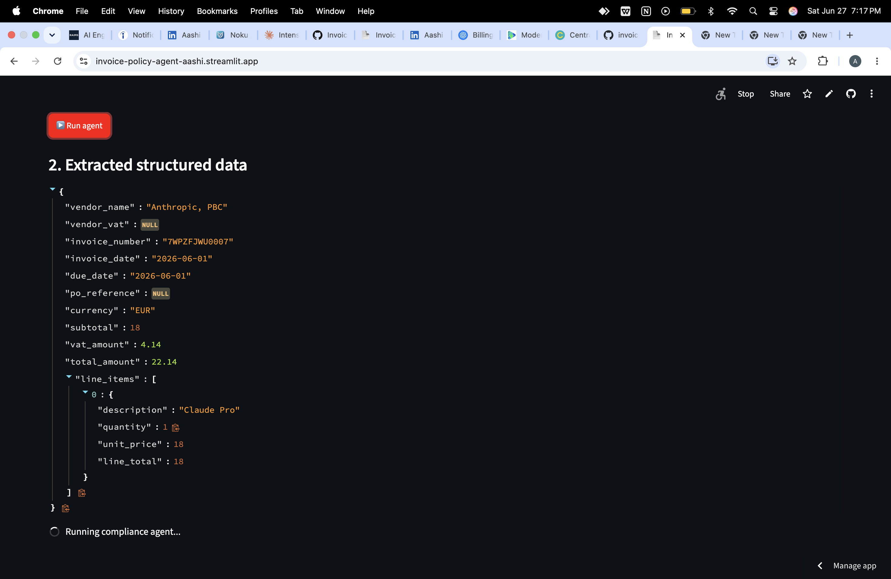
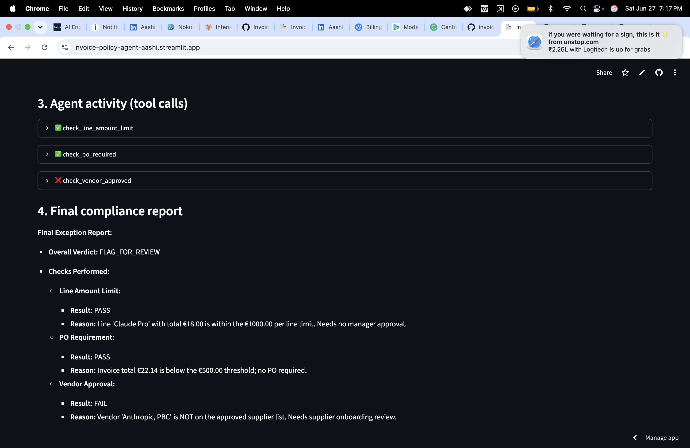

## Invoice Policy Agent

An agentic AI workflow that reviews supplier invoices against a company's expense policy by extracting structured data with GPT-4o-mini, then autonomously deciding which policy checks to run via OpenAI tool use.

🔗 Live demo:** [invoice-policy-agent-aashi.streamlit.app](https://invoice-policy-agent-aashi.streamlit.app/)

> Built as a small demonstration of the agentic AI pattern described by PwC, OpenAI and Anthropic — separating LLM reasoning from deterministic policy code.

---
## How it works (walkthrough)

1. Upload an invoice (text, .txt, or PDF):


2. The agent extracts structured data:


3. The agent decides which policy checks to run:


4. The agent produces a final exception report:


## What it does

1. Accepts an invoice as pasted text, a `.txt` file, or a `.pdf`
2. Uses an LLM to extract structured fields (vendor, line items, totals, PO reference, VAT)
3. Hands the structured data to an agent which decides which policy checks are relevant
4. The agent calls deterministic Python tools — line amount limit, PO requirement, vendor approval — in whatever order it deems best
5. Produces a final exception report with a verdict ('APPROVE' / 'FLAG_FOR_REVIEW' / 'REJECT') and per-check reasoning

The order of tool calls is not hard-coded. The model plans the workflow itself based on what it sees in the invoice whic is a small but real example of agentic behaviour.

## Example output

When given a formal supplier invoice (Invoice 1), the agent runs the line amount checks first because the document is line item dominant.
When given a casual catering invoice (Invoice 2), the agent runs the vendor check first apparently because the informal tone made vendor identity the most uncertain element.

Same Python code, different reasoning path, because the input changed.

## Architecture
    ┌─────────────┐
    │   Invoice   │ (text or PDF)
    └──────┬──────┘
           ▼
    ┌─────────────┐
    │  Extraction │ ← GPT-4o-mini, JSON response format
    └──────┬──────┘
           ▼
┌──────────────────────┐

│  Structured invoice  │

└──────────┬───────────┘
           ▼

┌──────────────────────┐

│   Agent (GPT + tool  │

│      schema)         │ ← decides which tools to call

└──────────┬───────────┘
           ▼

┌──────────────────────┐

│  Deterministic tools │ ← Python functions, fully auditable

│  - line amount limit │

│  - PO requirement    │

│  - vendor approval   │

└──────────┬───────────┘
           ▼

┌──────────────────────┐

│  Exception report    │

└──────────────────────┘

## Key design choices

- LLM for reasoning, code for judgement. The model decides  which  checks to run; deterministic Python decides whether they pass. This keeps the policy logic auditable and testable — a constraint that matters under the EU AI Act.
- Schema as contract. Tools are described to the model in a JSON schema. The model never touches Python directly. The same pattern PwC's agent OS uses to connect agents across multiple platforms.
- Graceful degradation. Handles encoding edge cases on `.txt` uploads, falls back across UTF-8 / CP1252 / Latin-1, and warns the user when a scanned PDF can't be parsed instead of failing silently.

## Tech stack

- Python 3.12
- OpenAI Python SDK (GPT-4o-mini with tool use and structured outputs)
- Streamlit (UI + deployment)
- pypdf (PDF text extraction)
- python-dotenv (local secret management)

## Running locally

```bash
git clone https://github.com/aashiimahajan11-star/invoice-policy-agent.git
cd invoice-policy-agent
pip install -r requirements.txt
echo "OPENAI_API_KEY=sk-your-key-here" > .env
streamlit run app.py
```

## What I'd build next

This is a deliberate demo, not a production system. To move it toward production I would add:

- Evaluation harness — a labelled dataset of ~50 invoices with expected verdicts, run automatically on every code change, scoring agent accuracy
- Persistence — Postgres for the audit log; every agent decision queryable by approver, vendor, date, verdict
- Authentication and role-based access — separating the submitter, the agent, and the approver
- Retry and fallback — handling OpenAI API errors and timeouts; degrading to a simpler heuristic when the model is unavailable
- Model routing — sending simple invoices to GPT-4o-mini and complex / high-value ones to GPT-4o or Claude
- OCR for scanned PDFs via pytesseract
- EU AI Act documentation — Article 50 transparency notices, plus the technical documentation required for limited-risk AI systems

These are the dimensions that turn a tool into a system.

## Why I built this

I wanted to understand the agentic AI pattern by building it, not by reading about it. The invoice exception use case is the one PwC describes in their published material as a leading edge application area; it lets me reason concretely about where the model adds value (extraction, orchestration, edge cases) vs. where deterministic code is needed (policy logic, reproducibility, audit).


**Built by [Aashi Mahajan](https://www.linkedin.com/in/aashimahajan11/)** — exploring agentic AI applications in finance, compliance, and operations.
